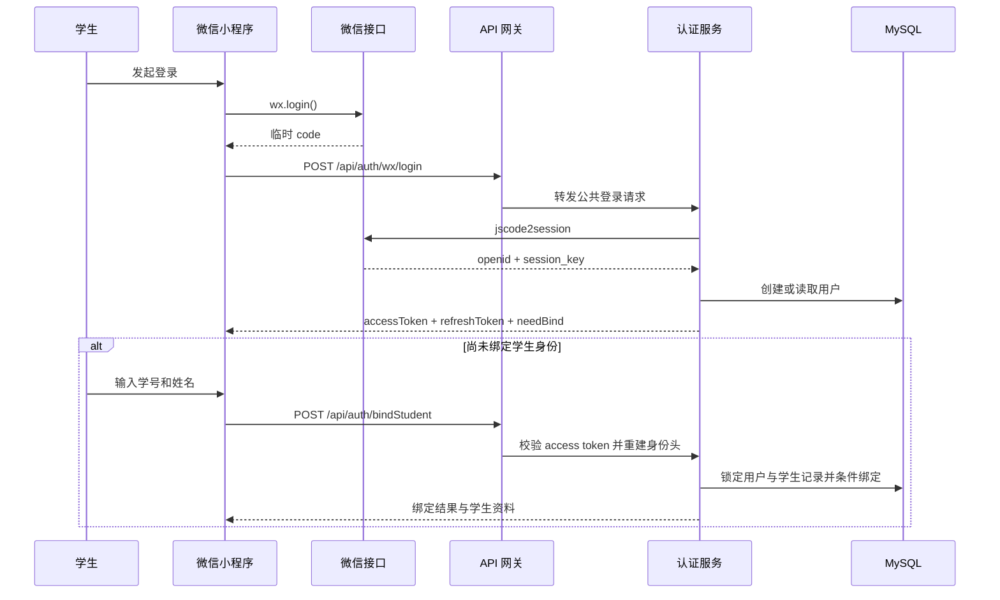
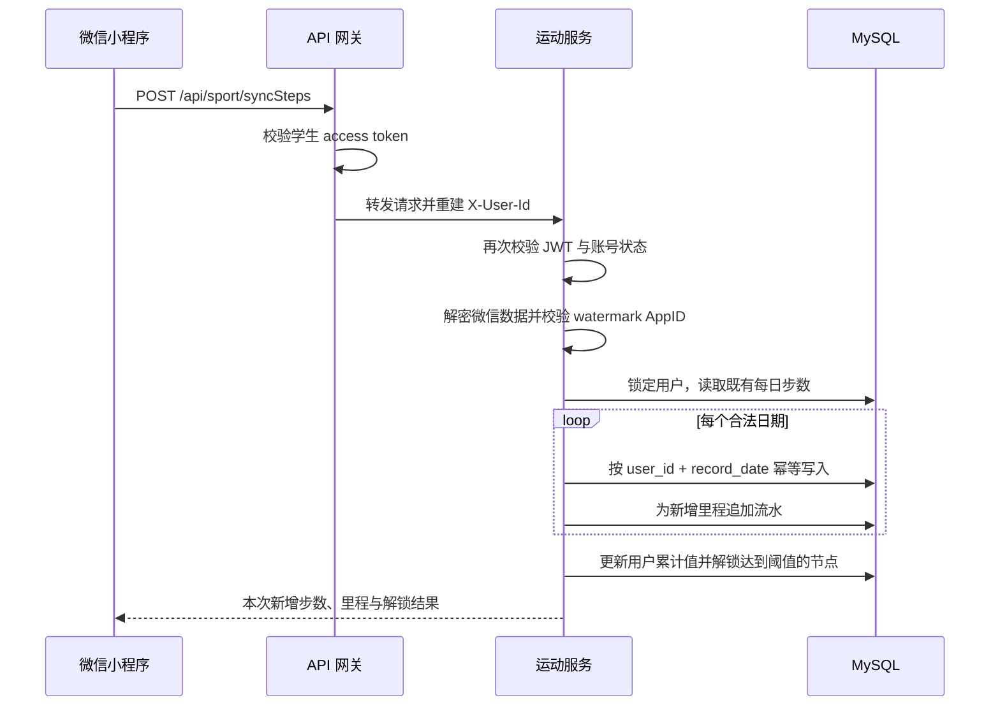
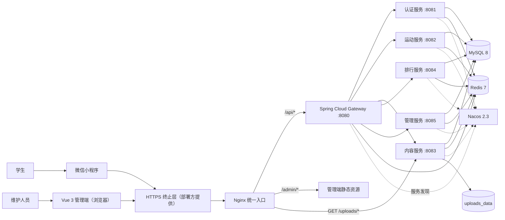
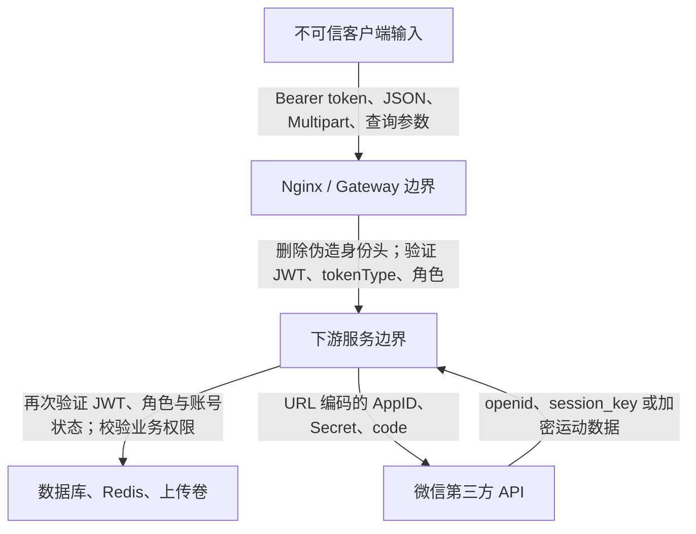

<div align="center">

# 云上重走长征路

将用户授权的微信运动步数转换为虚拟长征里程，把日常运动、路线推进、历史内容学习和高校活动管理连接在同一套开源系统中。

[](https://github.com/deathcmd/changzheng/actions/workflows/ci.yml)
[](https://github.com/deathcmd/changzheng/actions/workflows/codeql.yml)
[](https://github.com/deathcmd/changzheng/actions/workflows/gitleaks.yml)
[](LICENSE)


[项目概览](#项目概览) · [功能矩阵](#功能矩阵) · [系统架构](#系统架构) · [快速开始](#快速开始) · [API 概览](#api-概览) · [安全设计](#安全设计) · [参与贡献](#参与贡献)

</div>

## 项目概览

“云上重走长征路”是一套面向高校学生、主题教育活动组织者和项目维护人员的完整应用。学生通过原生微信小程序登录并绑定学校预先导入的身份资料，在明确授权后同步微信运动数据。系统将有效步数换算为累计里程，按里程阈值解锁长征路线节点及其文章、图片、音频和视频内容，同时提供总榜、年级榜和个人排名。

活动维护人员使用独立的 Vue 3 管理端完成学生资料导入、身份解绑、路线节点维护、学习内容维护、媒体上传和活动统计。后端采用 Java 17、Spring Boot 3.5 和 Spring Cloud 微服务架构，通过 Nginx 和 Spring Cloud Gateway 暴露统一入口，使用 MySQL 保存权威业务数据，Redis 支持登录限流，Nacos 提供服务发现。

该仓库提供的是可自行部署和继续开发的开源实现，不附带托管服务、真实学生数据、微信平台凭证或生产域名。运营方仍需自行完成微信小程序主体配置、HTTPS 接入、隐私告知、数据备份和本地合规评估。

### 项目解决的问题

传统校园健步活动通常只记录最终步数，运动过程和学习内容相互分离；活动组织者还需要在多个表格、群聊和后台之间人工核对身份与数据。本项目将这些流程收敛到一条可审计的业务链路中：

1. 管理员预先导入允许参与活动的学生身份。
2. 学生通过微信登录，并以学号与姓名匹配预置资料。
3. 学生主动授权微信运动数据，服务端校验、解密并按日期幂等同步。
4. 有效步数转换为里程，累计进度触发路线节点解锁。
5. 学生查看已解锁的历史内容并记录学习状态。
6. 排行与统计从同一套业务数据计算，减少重复录入和口径不一致。
7. 维护人员通过管理端完成后续纠错、解绑、内容调整和运营观察。

### 目标用户

| 角色 | 使用入口 | 主要任务 |
| --- | --- | --- |
| 学生用户 | 微信小程序 | 微信登录、身份绑定、步数同步、路线浏览、内容学习、排行查看 |
| 活动维护人员 | Vue 3 管理端 | 学生导入与维护、解绑、节点和内容管理、媒体上传、统计查看 |
| 部署运维人员 | Docker Compose、Nginx、环境变量 | 配置微信凭证和密钥、部署服务、迁移数据库、备份与恢复 |
| 开源贡献者 | Java、Vue、微信小程序与部署代码 | 修复问题、补充测试、维护依赖、扩展产品能力 |
| 安全研究者 | GitHub 私密漏洞报告 | 审查身份链、文件操作、第三方接口、部署与供应链风险 |

### 当前成熟度

- 核心学生流程、管理流程、数据库初始化和 Compose 部署路径已经实现。
- 仓库采用 Apache-2.0 许可证，提供贡献指南、安全策略、路线图、Issue/PR 模板和 CODEOWNERS。
- CI 覆盖后端测试与打包、管理端锁定安装和构建、小程序 JavaScript 语法、npm 生产依赖审计以及 Compose 配置。
- CodeQL 分析 Java 与 JavaScript，Gitleaks 扫描完整 Git 历史，Dependabot 监控 Maven、npm、GitHub Actions 和容器镜像。
- 项目仍处于早期采用阶段；“当前实现边界”中列出的能力不应被描述为已经完成。

## 功能矩阵

### 学生端

| 能力 | 当前实现 | 关键行为 |
| --- | --- | --- |
| 微信小程序登录 | 已实现 | 使用微信登录 code 换取 openid/session key，返回 access token 与 refresh token |
| 学生身份绑定 | 已实现 | 学号和姓名匹配管理员导入底表；并发绑定使用锁与条件更新避免重复占用 |
| 头像与昵称 | 部分实现 | 昵称可同步；微信临时头像转存到小程序本地持久目录，尚未提供跨设备头像托管 |
| Token 自动刷新 | 已实现 | 小程序持久化 refresh token；并发请求共享一次刷新，失败请求只重试一次 |
| 微信运动同步 | 已实现 | 校验微信 watermark AppID、限制记录数量、按日期幂等更新，只累计新增有效步数 |
| 里程换算 | 已实现 | 默认 2,000 步/公里，每日最多计入 30,000 步，结果保留两位小数并向下取整 |
| 异常步数标记 | 已实现 | 原始日步数超过 50,000 时标记异常，有效里程仍受每日上限约束 |
| 虚拟路线 | 已实现 | 展示累计步数、累计里程、当前节点、下一节点及路线节点状态 |
| 节点内容学习 | 已实现 | 解锁后可查看文章、图片、音频或视频，并记录已学习状态 |
| 个人总榜 | 已实现 | 分页展示启用用户，姓名在输出阶段脱敏 |
| 年级榜 | 已实现 | 仅在当前用户所属年级内排行 |
| 我的排名 | 已实现 | 返回个人名次和必要的班级/年级信息 |
| 成就展示 | 本地实现 | 小程序根据进度本地计算卡片，服务端尚无成就判定与持久化 API |

### 管理端

| 能力 | 当前实现 | 关键行为 |
| --- | --- | --- |
| 管理员登录 | 已实现 | 独立管理员账户与令牌；15 分钟内最多失败 10 次 |
| 仪表盘 | 已实现 | 总用户、今日活跃、平均里程、完成率、7 日活跃趋势、节点解锁 Top 10 |
| 学生列表 | 已实现 | 分页、关键词、专业、班级和绑定状态筛选 |
| Excel 导入 | 已实现 | 支持 `.xls`/`.xlsx`，最大 5 MB、5,000 行，输出导入批次及成功/更新/失败计数 |
| 导入模板 | 已实现 | 后端动态生成与解析字段一致的 Office Open XML `.xlsx` 模板 |
| 学生资料维护 | 已实现 | 未绑定记录可更新；已绑定关键身份字段需先解绑，避免两套身份数据分叉 |
| 停用与解绑 | 已实现 | 停用采用软删除；解绑同时清理学生底表和用户表关联 |
| 路线节点管理 | 已实现 | 创建、查看、更新和禁用路线节点 |
| 节点内容管理 | 已实现 | 创建/更新当前内容版本，支持软删除 |
| 媒体上传 | 已实现 | 图片、音频、视频扩展名与文件签名双重校验；最多批量 10 个文件 |
| 轮播图管理 | 未实现 | 公共 banner 接口存在，但当前固定返回空列表 |
| 运营审计日志 | 未实现 | 管理操作尚未写入独立审计表，已列入路线图 |

## 关键业务流程

### 登录与身份绑定



登录 code 和 refresh token 都是一次业务流程中的敏感输入。服务端不会把微信 session key 返回给客户端；access token、refresh token 和管理员 token 具有不同用途，refresh token 不能直接访问业务 API。

### 步数同步、里程入账与节点解锁



同一天重复同步不会再次累计已经入账的步数。里程流水采用追加式 delta 记录，便于后续追踪一次同步实际新增了多少里程。

### 内容访问

路线节点本身可以作为地图信息读取；节点下的学习内容、内容详情和“标记已学习”入口都在服务端校验：

1. access token 对应启用中的学生账户；
2. 当前用户已解锁目标节点；
3. 内容属于当前有效版本且未被禁用；
4. 学习记录按 `user_id + content_id` 幂等更新。

文章内容按纯文本渲染，不执行管理员输入的 HTML。音视频 URL 仍应由部署方控制来源和生命周期。

## 系统架构

### 组件关系



默认 Compose 仅将 Nginx 的 80 端口映射到宿主机。MySQL、Redis、Nacos、Gateway 和业务服务只加入内部 Docker 网络。生产环境应在 Nginx 前提供 HTTPS 终止、证书更新、访问日志和基础设施级请求限制。

### 信任边界



网关不是唯一安全边界。每个 Servlet 服务会再次校验 Bearer token，并从经过验证的 claims 重建 `X-User-Id`、`X-Admin-Id` 和 `X-User-Type`。即使调用方能够直接访问内部服务，也不能仅通过伪造这些 Header 获得身份。

## 模块与目录

| 路径 | 默认端口 | 对外路径 | 主要职责 |
| --- | ---: | --- | --- |
| `changzheng-gateway` | 8080 | `/api/**` | 服务路由、第一层 JWT 校验、角色隔离、身份头清洗与重建 |
| `changzheng-auth` | 8081 | `/api/auth/**`、`/api/common/**` | 微信登录、学生绑定、用户资料、令牌刷新、公开配置 |
| `changzheng-sport` | 8082 | `/api/sport/**` | 微信运动解密、每日步数、里程流水、进度与节点解锁 |
| `changzheng-content` | 8083 | `/api/content/**`、`/uploads/**` | 路线内容、学习记录、受控媒体上传和读取 |
| `changzheng-rank` | 8084 | `/api/rank/**` | 总榜、年级榜、个人排名与姓名脱敏 |
| `changzheng-admin` | 8085 | `/api/admin/**` | 管理员认证、学生导入、节点内容管理、仪表盘 |
| `changzheng-common` | - | - | 公共实体、返回模型、异常处理、JWT 过滤器、账号状态核验 |
| `changzheng-admin-web` | Vite 开发端口 | `/admin/**` | Vue 3 管理界面 |
| `changzheng-miniprogram` | 微信开发者工具 | 小程序页面 | 学生端交互、Token 刷新、接口封装和本地头像处理 |
| `sql` | - | - | V1-V4 数据库初始化、种子数据与迁移 |
| `docker` | - | - | Java 运行镜像与 Nginx 配置 |
| `.github` | - | - | CI、CodeQL、Gitleaks、Dependabot 与协作模板 |

## 技术栈

| 层级 | 主要技术 | 说明 |
| --- | --- | --- |
| 小程序 | 原生微信小程序 | 不依赖跨端框架；通过封装的 request/api 层访问后端 |
| 管理端 | Vue 3.5、Vite 8、Element Plus、Pinia、ECharts | 使用 npm 锁文件；生产构建默认连接真实 API |
| 服务端 | Java 17、Spring Boot 3.5、Spring Cloud 2025.0 | Maven 多模块项目，使用仓库内 Wrapper |
| 数据访问 | MyBatis-Plus、JdbcTemplate、Druid | 业务实体操作和聚合查询并存 |
| 身份与安全 | Spring Security、JJWT、BCrypt | Stateless Bearer token；管理员密码使用 BCrypt |
| 数据与协调 | MySQL 8、Redis 7 | MySQL 保存权威数据，Redis 支持管理员登录限流 |
| 服务发现 | Nacos 2.3 | Compose 默认以单机模式运行 |
| 边缘与部署 | Nginx、Docker Compose | 统一路由、静态管理端、安全响应头、内部网络隔离 |
| 质量与供应链 | JUnit 5、Mockito、GitHub Actions、CodeQL、Gitleaks、Dependabot | Actions 使用完整 commit SHA 固定第三方步骤 |

依赖的准确版本以根目录 `pom.xml`、`changzheng-admin-web/package-lock.json` 和各 Dockerfile 为准，不以 README 中的概括版本作为升级依据。

## 数据模型与一致性

### 主要数据表

| 表 | 用途 | 关键约束 |
| --- | --- | --- |
| `t_user` | 微信用户、绑定身份、累计步数与里程 | openid 唯一；绑定后学号唯一 |
| `t_student_info` | 管理员预导入的学生身份底表 | 学号唯一；记录绑定状态与导入批次 |
| `t_daily_steps` | 每日原始/有效步数 | `user_id + record_date` 唯一，保证日记录幂等 |
| `t_mileage_ledger` | 里程增量流水 | V4 后使用追加式记录保留每次同步 delta |
| `t_route_node` | 路线节点与里程阈值 | 节点 code 唯一；支持禁用 |
| `t_user_node_progress` | 用户节点解锁状态 | `user_id + node_id` 唯一 |
| `t_node_content` | 节点文章、图片、音频、视频 | 当前版本、内容类型、排序与状态字段 |
| `t_user_learn_record` | 内容学习记录 | `user_id + content_id` 唯一 |
| `t_admin` | 独立管理员账户 | username 唯一；支持角色和停用状态 |
| `t_system_config` | 系统配置 | config_key 唯一，可区分公开配置 |
| `t_achievement` / `t_user_achievement` | 成就配置与用户成就 | 表结构存在，当前主流程尚未接入服务端成就判定 |
| `t_leaderboard_snapshot` | 排行快照预留 | 当前排行榜直接查询权威用户数据 |

### 数据完整性规则

- 学生绑定对用户记录加锁，并通过条件更新学生底表，防止两个并发请求绑定同一学号。
- 已绑定学生的姓名、专业、班级和年级不能直接被后台覆盖；需要先解绑再修改。
- 步数同步在事务内锁定用户，比较同日旧值，只把新增有效步数加入累计值。
- 单次微信同步最多处理 31 条每日记录，阻止无界输入扩大事务。
- 原始日步数与有效日步数分开保存，异常数据仍受计入上限约束。
- 学习记录使用唯一键幂等写入；节点和内容删除采用禁用/软删除。
- 管理员仪表盘和运动服务共享 `TOTAL_MARCH_DISTANCE`，部署时必须配置为同一值。

## API 概览

所有客户端都应通过 Nginx/Gateway 的 `/api` 入口调用。下表是稳定的功能分组，不替代控制器源码或 OpenAPI 输出。

### 认证与公共配置

| 方法 | 路径 | 身份 | 用途 |
| --- | --- | --- | --- |
| POST | `/api/auth/wx/login` | 公开 | 使用微信 code 登录或创建用户 |
| POST | `/api/auth/refresh` | refresh token | 换取新的 access/refresh token |
| POST | `/api/auth/bindStudent` | 学生 access token | 绑定预导入的学号与姓名 |
| GET | `/api/auth/userInfo` | 学生 access token | 获取当前用户资料 |
| POST | `/api/auth/profile` | 学生 access token | 更新昵称和受支持的头像 URL |
| GET | `/api/common/config` | 公开 | 获取允许公开的系统配置 |
| GET | `/api/common/banners` | 公开 | 当前返回空列表 |

### 运动、内容与排行

| 方法 | 路径 | 身份 | 用途 |
| --- | --- | --- | --- |
| POST | `/api/sport/syncSteps` | 学生 | 解密并同步微信运动数据 |
| GET | `/api/sport/progress` | 学生 | 获取累计里程与节点进度 |
| GET | `/api/sport/dailySteps` | 学生 | 按日期范围获取每日步数 |
| GET | `/api/content/route/nodes` | 学生 | 获取路线节点及当前用户解锁状态 |
| GET | `/api/content/node/{nodeId}` | 学生 | 获取节点详情 |
| GET | `/api/content/node/{nodeId}/contents` | 学生且节点已解锁 | 获取节点学习内容 |
| GET | `/api/content/detail/{contentId}` | 学生且节点已解锁 | 获取单项内容详情 |
| POST | `/api/content/learned/{contentId}` | 学生且节点已解锁 | 记录已学习 |
| GET | `/api/rank/total` | 学生 | 获取个人总榜，支持分页 |
| GET | `/api/rank/grade` | 已绑定学生 | 获取当前年级排行 |
| GET | `/api/rank/my` | 学生 | 获取当前用户排名 |

排行榜分页参数 `page` 从 1 开始，`pageSize` 取值 1-100。

### 管理与上传

| 方法 | 路径 | 身份 | 用途 |
| --- | --- | --- | --- |
| POST | `/api/admin/login` | 公开但限流 | 管理员登录 |
| GET | `/api/admin/info` | 管理员 | 获取管理员信息 |
| GET | `/api/admin/stats/dashboard` | 管理员 | 获取仪表盘统计 |
| GET | `/api/admin/students` | 管理员 | 查询学生列表 |
| GET | `/api/admin/students/stats` | 管理员 | 获取绑定统计 |
| GET | `/api/admin/students/template` | 管理员 | 下载 `.xlsx` 导入模板 |
| POST | `/api/admin/students/import` | 管理员 | 导入学生数据 |
| PUT | `/api/admin/students/{id}` | 管理员 | 更新允许修改的学生字段 |
| DELETE | `/api/admin/students/{id}` | 管理员 | 停用未绑定学生 |
| POST | `/api/admin/students/{id}/unbind` | 管理员 | 解除用户与学生身份关联 |
| GET/POST/PUT/DELETE | `/api/admin/nodes/**` | 管理员 | 节点和节点内容管理 |
| POST | `/api/content/file/upload/image`、`/api/content/file/upload/audio`、`/api/content/file/upload/video` | 管理员 | 上传单个媒体文件 |
| POST | `/api/content/file/upload/batch` | 管理员 | 最多批量上传 10 个文件 |
| DELETE | `/api/content/file/delete` | 管理员 | 删除上传根目录内的指定文件 |

### 统一响应

大多数 JSON API 使用以下结构：

```json
{
  "code": 200,
  "message": "操作成功",
  "data": {},
  "timestamp": 1786435200000
}
```

常见错误码分组：

| 范围 | 含义 | 示例 |
| --- | --- | --- |
| `400xx` | 参数错误 | 缺少参数、字段格式错误 |
| `401xx` | 认证失败 | token 缺失、过期、类型错误 |
| `402xx` | 微信接口错误 | code 无效、数据解密失败、session 过期 |
| `403xx` | 权限错误 | 角色不匹配、节点未解锁 |
| `404xx` | 资源不存在 | 用户、节点或内容不存在 |
| `409xx` | 业务冲突 | 学号已绑定、重复数据、同步过于频繁 |
| `500xx` | 服务端错误 | 数据库、Redis 或内部服务异常 |

网关的认证拒绝会直接使用 HTTP 401/403 和简化 JSON；业务服务的部分业务异常仍以统一响应体表达。客户端应同时检查 HTTP 状态与响应 `code`。

## 快速开始

### 1. 获取源码

```bash
git clone https://github.com/deathcmd/changzheng.git
cd changzheng
```

### 2. 环境要求

| 工具 | 要求 | 用途 |
| --- | --- | --- |
| Git | 当前受支持版本 | 获取源码和参与贡献 |
| JDK | 17 | 编译和运行所有 Java 模块 |
| Maven | 无需全局安装 | 仓库 Wrapper 固定并校验 Maven 3.9.11 |
| Node.js | 24.x LTS（推荐）或 22.12+ | CI 使用 24.x；构建管理端并检查小程序 JavaScript |
| npm | 与 Node.js 配套 | 按 lockfile 安装管理端依赖 |
| Docker Engine | 支持 Compose 插件 | 启动 MySQL、Redis、Nacos、服务和 Nginx |
| Bash | Linux/macOS/WSL/Git Bash | 执行 `deploy.sh` |
| 微信开发者工具 | 支持基础库 3.3.4 | 运行和发布原生微信小程序 |

首次运行 Maven Wrapper 会访问 Maven Central 下载经过 SHA-256 校验的 Maven 发行包。npm 安装需要访问 lockfile 中记录的 registry。

### 3. 验证源码

Linux、macOS、WSL 或 Git Bash：

```bash
./mvnw --batch-mode --no-transfer-progress clean verify
npm --prefix changzheng-admin-web ci --ignore-scripts
npm --prefix changzheng-admin-web run build
npm --prefix changzheng-admin-web audit --audit-level=high
find changzheng-miniprogram/miniprogram -name '*.js' -print0 | xargs -0 -n1 node --check
bash -n deploy.sh
docker compose --env-file .env.example config --quiet
```

Windows PowerShell：

```powershell
.\mvnw.cmd --batch-mode --no-transfer-progress clean verify
npm --prefix changzheng-admin-web ci --ignore-scripts
npm --prefix changzheng-admin-web run build
npm --prefix changzheng-admin-web audit --audit-level=high
docker compose --env-file .env.example config --quiet
```

`npm ci --ignore-scripts` 严格使用 lockfile 并禁止第三方依赖在安装阶段执行生命周期脚本。若 lockfile 与 `package.json` 不一致，命令会失败而不是静默修改依赖树。

### 4. 准备部署配置

```bash
cp .env.example .env
```

PowerShell：

```powershell
Copy-Item .env.example .env
```

逐项替换所有占位值：

| 环境变量 | 必需 | 要求与影响 |
| --- | --- | --- |
| `MYSQL_ROOT_PASSWORD` | 是 | MySQL root 随机强密码，仅供数据库初始化和运维 |
| `MYSQL_APP_PASSWORD` | 是 | 应用用户 `changzheng` 的独立密码，不与 root 复用 |
| `REDIS_PASSWORD` | 是 | Redis 密码；管理员登录限流依赖 Redis |
| `JWT_SECRET` | 是 | 至少 32 个随机 ASCII 字节；所有网关和服务实例必须保持一致 |
| `AES_KEY` | 是 | 恰好 16、24 或 32 个 ASCII 字节；更换会影响旧加密数据读取 |
| `WX_APPID` | 是 | 微信小程序 AppID；还用于运动数据 watermark 校验 |
| `WX_SECRET` | 是 | 微信小程序 AppSecret，只应保存在服务端 |
| `ADMIN_USERNAME` | 是 | 首次启动且无启用管理员时创建的初始用户名 |
| `ADMIN_PASSWORD` | 是 | 至少 12 字符；初始创建后以 BCrypt 哈希保存 |
| `CORS_ALLOWED_ORIGIN` | 是 | 管理端精确 Origin，例如 `https://admin.example.org`；不能使用通配符或路径 |
| `FILE_UPLOAD_URL` | 是 | 对外媒体根 URL，例如 `https://app.example.org/uploads` |
| `TOTAL_MARCH_DISTANCE` | 否 | 默认 25,000 公里；运动进度与管理仪表盘共用 |

不要把 `.env`、微信凭证、JWT、私钥、数据库导出、学生资料或上传内容提交到 Git。示例值只用于说明格式，不能直接用于生产。

生成随机值时应使用操作系统的密码管理工具或密钥管理服务；不要从 README、Issue、截图或聊天记录复用示例字符串。

### 5. 启动完整环境

```bash
./deploy.sh
```

部署脚本将按顺序：

1. 检查 Docker、Compose、Maven Wrapper、npm 和 `.env`；
2. 拒绝仍含模板占位值的配置；
3. 静态校验 Compose；
4. 运行后端 `clean verify`；
5. 锁定安装并构建管理端；
6. 拉取基础镜像并构建 Java 服务；
7. 启动 Compose 并显示服务状态。

主要入口：

| 地址 | 用途 |
| --- | --- |
| `http://localhost/admin/` | 管理端页面 |
| `http://localhost/api/` | 学生端和管理端 API |
| `http://localhost/uploads/` | 上传媒体的只读 HTTP 入口 |
| `http://localhost/health` | Nginx 健康检查 |

本地 HTTP 只用于开发或内网验证。微信小程序生产请求域名必须使用 HTTPS，并在微信公众平台登记。

### 6. 管理端开发

```bash
npm --prefix changzheng-admin-web ci --ignore-scripts
npm --prefix changzheng-admin-web run dev
```

开发服务器默认将 `/api` 代理到 `http://localhost:8080`。仅在界面开发时显式设置 `VITE_USE_MOCK=true` 才会启用模拟管理员登录；默认行为是连接真实后端。

### 7. 微信小程序开发

1. 使用微信开发者工具导入 `changzheng-miniprogram`。
2. 检查 `changzheng-miniprogram/miniprogram/config/index.js`。
3. 仓库默认 `currentEnv = 'prod'`、`useMock = false`，生产 URL 使用不会产生真实请求的 `.invalid` 占位域名。
4. 发布前将生产 `baseUrl` 改为实际 HTTPS API 域名。
5. 确认小程序项目 AppID 与服务端 `WX_APPID` 一致。
6. 在微信公众平台登记 request 合法域名，并验证微信运动权限流程。
7. 真机验证登录、刷新、身份绑定、步数同步、节点解锁和内容访问。

若切换到 `dev`，当前配置会启用 Mock。Mock 数据只能用于本地 UI 调试，不能作为发布验收结果。

## 数据库初始化与升级

### 新部署

首次创建 MySQL 数据卷时，MySQL 镜像按文件名顺序执行 `sql/`：

| 脚本 | 作用 |
| --- | --- |
| `V1__init_schema.sql` | 创建数据库和核心表 |
| `V2__init_data.sql` | 写入公开系统配置、路线节点、示例内容和成就配置 |
| `V3__security_hardening.sql` | 允许绑定前用户没有学号，并禁用历史已知默认管理员 |
| `V4__content_and_data_integrity.sql` | 拆分学院/专业、追加式里程流水、规范内容字段、创建学习记录 |

初始管理员不在 SQL 中写入公开默认密码。只有数据库中不存在启用中的管理员时，管理服务才使用 `ADMIN_USERNAME` 和 `ADMIN_PASSWORD` 创建 `SUPER_ADMIN`。

### 已有部署

MySQL 初始化目录不会对已有数据卷重复执行。升级时必须：

1. 记录当前 Git commit 和应用版本；
2. 备份并验证 MySQL 数据；
3. 备份上传卷；
4. 审核新 SQL 和环境变量变化；
5. 按版本顺序手工执行未应用迁移；
6. 在非生产环境验证读取、写入和回滚方案；
7. 再部署新镜像。

不要通过删除数据卷“重跑迁移”，也不要在没有备份时逆向执行 SQL。详细命令见 [部署文档](部署文档.md)。

## 安全设计

### 威胁与控制

| 攻击面 | 主要风险 | 当前控制 |
| --- | --- | --- |
| 客户端身份 Header | 伪造用户/管理员 ID 绕过授权 | 网关和下游服务均删除客户端身份头，再从已验证 JWT claims 重建 |
| JWT | 弱密钥、过期令牌、refresh token 被当作 access token | 启动时校验至少 32 字节；验证签名和期限；检查 `tokenType`、`userType` 与角色 |
| 已停用账户 | 旧 token 在到期前继续访问 | 每个受保护 Servlet 请求重新查询学生/管理员启用状态 |
| 管理员登录 | 暴力猜测、缓存故障绕过 | BCrypt 密码；Redis Lua 原子计数；15 分钟最多 10 次；Redis 异常时安全失败 |
| CSRF/CORS | 浏览器跨站请求携带身份 | API 不使用 Cookie/Session，只接受显式 Authorization Bearer token；CORS 限定单一配置 Origin 并禁止 credentialed requests |
| 学生绑定 | 并发重复绑定或覆盖他人记录 | 数据库行锁、唯一键和条件更新；已绑定关键身份字段禁止直接改写 |
| 微信接口 | 参数注入、错误 AppID 数据、敏感响应泄露 | AppID/Secret/code URL 编码；校验上游字段和 watermark AppID；session key 不返回客户端 |
| 运动同步 | 重放累计、未来日期、超大输入、并发覆盖 | 单次最多 31 条；日期和数值范围校验；用户行锁；同日 delta 计算；每日计入上限 |
| 内容访问 | 未达里程读取隐藏内容 | 内容列表、详情和学习记录都验证启用用户及节点解锁状态 |
| 文章展示 | 管理员内容触发存储型 XSS | 小程序按纯文本渲染；V4 将历史段落/换行 HTML 转为文本 |
| 文件上传 | 双扩展名、伪造 MIME、路径注入、符号链接逃逸 | 上传类型和后缀映射到代码常量；校验魔数；UUID 文件名；真实路径必须位于上传根目录 |
| 文件删除 | `../` 路径穿越或删除任意文件 | 归一化、根目录边界和符号链接检查；Nginx 对 `/uploads` 只允许 GET/HEAD |
| Excel 导入 | 内存耗尽、超大批次、恶意格式 | 扩展名限制、5 MB 和 5,000 行上限、字段长度校验；流式解析仍在路线图 |
| Secret 泄露 | `.env`、微信 Secret、JWT/AES Key 进入历史 | `.gitignore`、GitHub Secret scanning/Push protection、Gitleaks 全历史扫描 |
| CI 供应链 | Action 标签被重新指向、安装脚本执行任意代码 | Actions 固定完整 commit SHA；管理端使用 lockfile 和 `--ignore-scripts` |
| 依赖漏洞 | Maven/npm/镜像长期未更新 | Dependabot、npm audit、CodeQL；主兼容线变更需单独迁移与测试 |
| 网络暴露 | 数据库、Redis、Nacos 直接暴露公网 | Compose 不映射内部服务端口，仅暴露 Nginx |
| 容器权限 | 服务被利用后拥有 root 权限 | Java 运行容器使用非 root 用户 |

### Token 与身份模型

- 学生 access token：访问学生运动、内容、排行和资料接口。
- 学生 refresh token：仅用于 `/api/auth/refresh`，不能调用业务接口。
- 管理员 access token：访问 `/api/admin/**` 和受保护的文件操作。
- 网关先验证签名、`tokenType`、用户类型和角色；下游服务再验证一次。
- 下游业务代码读取的身份 Header 不是客户端信任输入，而是安全过滤器生成的内部上下文。
- API 不使用浏览器 Cookie 身份，因此 Spring Security 的 CSRF 防护按架构显式禁用。

### 文件上传边界

支持的扩展名：

- 图片：`jpg`、`jpeg`、`png`、`gif`、`webp`、`bmp`
- 音频：`mp3`、`wav`、`ogg`、`m4a`、`flac`、`aac`
- 视频：`mp4`、`avi`、`mov`、`wmv`、`flv`、`mkv`、`webm`

扩展名白名单不等于内容安全。服务还检查文件头，但当前没有病毒扫描、媒体转码、图片解码重写或内容审核。生产环境如果允许不受信任的运营人员上传，应在独立处理管线中增加恶意文件扫描、媒体重编码和对象存储隔离。

### 数据保护说明

当前学生标识、姓名和微信 session key 沿用项目早期的确定性 AES 格式。它可以降低数据库明文暴露，但不提供现代认证加密的完整性保证。路线图已记录带版本标识的 AES-GCM 迁移，包括兼容旧数据读取、字段长度评估和数据迁移测试。

在迁移完成前：

- 不要随意更换 `AES_KEY`，否则旧数据可能无法读取；
- 不要在日志、Issue 或错误响应中输出解密值；
- 数据库备份与 AES Key 应分开存放；
- 生产环境应限制数据库管理员和备份读取权限。

### 安全报告

请使用 [GitHub 私密漏洞报告](https://github.com/deathcmd/changzheng/security/advisories/new)，不要在公开 Issue 中发布可利用细节、凭证、学生数据或生产地址。支持范围和报告内容要求见 [SECURITY.md](SECURITY.md)。

## 测试与持续集成

### 本地测试覆盖

当前 Java 测试覆盖的重点包括：

- JWT 身份 Header 清洗、token 类型、角色和过期处理；
- 启动 Secret 长度校验；
- 微信登录与学生绑定关键分支；
- 步数同步增量累计、重复同步和异常输入；
- 内容解锁访问控制；
- 上传签名、路径式文件名、未知分类、跨分类扩展名和删除路径穿越；
- 管理员登录限流相关行为；
- 节点请求参数校验与节点管理；
- 学生解绑、停用和数据一致性。

管理端请求拦截器还覆盖令牌附加、二进制响应、登录失效确认/取消和单次退出跳转；小程序请求测试覆盖异常响应、网络错误、查询参数、并发令牌刷新和上传错误。测试数量与结果以本次命令及最新 CI 输出为准。

管理端 Chromium 回归测试使用真实生产构建，覆盖登录后返回嵌套路由、菜单跳转与高亮、取消退出和确认退出。测试在浏览器网络层提供固定 API 响应，不访问真实账户或学生数据，也不替代 MySQL、Redis 和微信接口联调。CI 使用仍处于支持期的 Node.js 24 LTS，版本生命周期见 [Node.js 官方发布计划](https://github.com/nodejs/Release#release-schedule)。

```bash
./mvnw --batch-mode --no-transfer-progress clean verify
node --test changzheng-miniprogram/tests/*.test.cjs
cd changzheng-admin-web
npm ci --ignore-scripts
npm test
npm run build
npx --no-install playwright install chromium
npm run test:e2e
npm audit --registry=https://registry.npmjs.org
```

### GitHub Actions

| Workflow | Job | 验证内容 |
| --- | --- | --- |
| CI | `backend` | Maven 8 模块 `clean verify` |
| CI | `admin-web` | `npm ci --ignore-scripts`、请求回归测试、Vite 构建、Chromium 登录/导航/退出测试、依赖审计 |
| CI | `miniprogram` | 所有小程序 JavaScript 的 `node --check`、请求与令牌刷新回归测试 |
| CI | `deployment-config` | `bash -n deploy.sh` 与 Compose 静态校验 |
| CodeQL | Java | 手动编译后进行 Java 安全分析 |
| CodeQL | JavaScript | 分析管理端和小程序 JavaScript/TypeScript |
| Secret scanning | Git history | 获取完整历史并执行 Gitleaks |

CodeQL workflow 成功表示分析上传成功，不应被单独解释为“永远没有漏洞”。维护人员仍需检查 Security 页面中的开放和已处置告警，并记录误报的架构依据。

## 运维与故障排查

### 常用命令

```bash
# 查看所有容器
docker compose --env-file .env ps

# 查看网关和认证服务最近 200 行日志
docker compose --env-file .env logs --tail=200 gateway
docker compose --env-file .env logs --tail=200 auth-service

# 持续查看某个服务
docker compose --env-file .env logs -f sport-service

# 重新构建并启动
docker compose --env-file .env build --pull
docker compose --env-file .env up -d
```

### 常见问题

#### 部署脚本提示仍有占位值

`deploy.sh` 会拒绝包含 `replace-with-` 或示例域名的 `.env`。逐项替换模板，不要删除变量来绕过检查。

#### 服务启动时提示 JWT_SECRET 太短

`JWT_SECRET` 按 UTF-8 字节计数必须至少 32 字节，并且网关与全部服务必须使用完全相同的值。不要使用短词、项目名或公开示例。

#### 旧数据在更换 AES_KEY 后无法读取

这是当前加密格式的已知运维约束。恢复原 Key 和对应数据库备份，再按照未来的版本化迁移流程轮换；不要对生产数据反复尝试不同 Key。

#### 管理员无法登录且 Redis 不可用

登录限流设计为 fail-closed。先修复 Redis 连接、密码或服务状态，不要临时绕过限流逻辑。

#### 小程序请求 `example.invalid`

仓库故意使用不可解析的安全占位域名。发布前修改小程序生产 `baseUrl`，并在微信公众平台登记相同 HTTPS 域名。

#### 管理端 API 返回 401

确认请求使用管理员 access token、Header 格式为 `Authorization: Bearer <token>`，且管理员账户仍为启用状态。学生 token 不能访问 `/api/admin/**`。

#### 节点内容返回“未解锁”或“内容不存在”

确认用户为启用状态、累计里程已经触发节点解锁、节点和内容均为启用/当前版本。服务端不会因为客户端直接拼接 URL 而跳过解锁校验。

#### Docker Compose 配置通过但服务无法运行

`docker compose config` 只验证静态配置。继续检查 Docker daemon、镜像拉取、端口占用、容器日志、MySQL 数据卷状态、Nacos 注册情况和环境变量值。

## 当前实现边界

以下内容明确尚未完成，提交 Issue、申请材料或产品介绍时不要描述为现有功能：

- banner 接口当前返回空列表，尚无管理员可维护的轮播模型；
- 成就卡片在小程序本地计算，服务端成就判定和持久化未接入；
- 当前只有个人总榜、年级个人榜和“我的排名”，没有班级聚合榜；
- 头像选择结果仅持久化在当前设备，没有受控的服务端头像上传和审核流程；
- 内容禁用不会自动删除其历史上传文件，媒体引用和回收需人工管理；
- Excel 已限制 5 MB 和 5,000 行，但当前仍一次读取完整工作表，不是流式解析；
- 学生敏感字段仍使用旧确定性 AES 格式，AES-GCM 迁移尚未完成；
- 管理端关键操作尚无独立运营审计日志；
- 数据库迁移、并发绑定和并发步数同步尚缺基于真实 MySQL/Redis 的容器集成测试；
- 仓库没有提供托管环境、SLA、真实学校数据、下载量或部署采用量证明。

维护计划见 [ROADMAP.md](ROADMAP.md)，完整业务说明见 [使用文档](使用文档.md)。

## 生产部署检查清单

在公开服务前至少确认：

- [ ] 微信小程序主体、AppID、AppSecret 和 request 合法域名已正确配置；
- [ ] API 与管理端使用 HTTPS，HTTP 自动跳转或不可从公网访问；
- [ ] MySQL、Redis、Nacos 和内部服务没有映射公网端口；
- [ ] 数据库、Redis、JWT、AES 和管理员凭证互不复用；
- [ ] Secret 存储在部署平台的安全配置中，而不是镜像或 Git；
- [ ] CORS 使用准确管理端 Origin，不是 `*`；
- [ ] 初始管理员登录后已核验账户和密码管理流程；
- [ ] MySQL 与上传卷有自动备份，并实际演练过恢复；
- [ ] 日志采集不会记录 token、微信 code/session key、学生姓名或学号；
- [ ] 文件上传大小、磁盘配额、媒体审核和生命周期策略符合本地要求；
- [ ] 已运行后端测试、前端构建、npm audit、小程序语法和 Compose 校验；
- [ ] 已检查 GitHub CodeQL、Dependabot 和 Secret scanning 的开放告警；
- [ ] 隐私告知说明了收集字段、微信运动用途、保存期限和用户权利；
- [ ] 升级前已审核 SQL、`.env.example`、Compose、依赖锁文件和路线图边界。

该清单不是法律意见，也不能替代组织自身的安全评审、隐私影响评估和应急预案。

## 开发约定

- 后端保持 Java 17 兼容，不在单个模块私自升级平台版本。
- 行为变化应补充或更新测试；安全边界变化需要负向测试。
- 新环境变量必须同时更新 `.env.example`、Compose 和部署文档。
- 不信任客户端提供的 `X-User-Id`、`X-Admin-Id` 或 `X-User-Type`。
- 文件路径、上传内容、请求大小和外部 URL 必须在进入可信区域前校验。
- 不在日志中输出 Bearer token、微信 code/session key、AppSecret、学生身份或解密后的敏感数据。
- 数据库结构变化使用新版本迁移，不直接改写已发布的历史迁移。
- 依赖主版本和 Spring 平台兼容线升级应单独提交，并运行完整 CI/CodeQL。
- 用户流程、API、部署方式或实现边界变化时同步更新 README、部署文档和使用文档。

## 参与贡献

1. 先阅读 [使用文档](使用文档.md) 中的现有能力和边界。
2. 在 [ROADMAP.md](ROADMAP.md) 中确认是否已有相关计划。
3. 对较大的设计变化先创建 Issue，说明问题、用户影响、数据迁移和兼容性。
4. 保持 Pull Request 聚焦，避免把业务改造、依赖主版本和格式化混在一起。
5. 添加与风险相称的测试，并在本地运行完整验证命令。
6. 在 PR 中说明安全影响、数据库影响、环境变量变化和人工验证结果。
7. 不提交真实凭证、真实学生数据、上传媒体、数据库导出、`node_modules` 或 `dist`。

提交贡献即表示贡献内容按 [Apache License 2.0](LICENSE) 提供，除非明确标记为 “Not a Contribution”。详细要求见 [CONTRIBUTING.md](CONTRIBUTING.md)。

### 有用的维护文档

- [部署文档](部署文档.md)：环境变量、Compose、迁移、更新与回滚
- [使用文档](使用文档.md)：学生端、管理端和开发调试流程
- [安全策略](SECURITY.md)：支持版本、私密报告方式和安全基线
- [贡献指南](CONTRIBUTING.md)：开发检查和 Pull Request 要求
- [路线图](ROADMAP.md)：明确尚未实现的近期与长期工作
- [许可证](LICENSE) 与 [NOTICE](NOTICE)：使用、修改和分发条件

## 开源许可证

本项目采用 [Apache License 2.0](LICENSE) 开源。可以在许可证允许范围内使用、修改和分发，但必须保留相关许可证与版权声明。仓库或其贡献者名称不得被理解为对下游部署、内容或运营活动的背书。

---

维护状态、测试结果和安全告警以 [GitHub 仓库](https://github.com/deathcmd/changzheng) 当前 `main` 分支为准。
