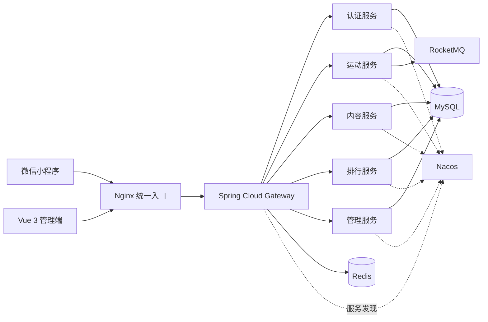

<div align="center">

# 云上重走长征路

将微信运动数据映射到虚拟长征路线的高校主题教育与运动学习平台。

[](https://github.com/deathcmd/changzheng/actions/workflows/ci.yml)


[核心能力](#核心能力) · [系统架构](#系统架构) · [快速开始](#快速开始) · [安全设计](#安全设计) · [参与贡献](#参与贡献)

</div>

## 项目简介

“云上重走长征路”面向高校学生与活动组织者，把用户授权的微信运动步数折算为虚拟长征里程。学生在运动过程中逐步解锁历史节点与图文、音视频学习内容，并可查看个人、班级和年级排行；维护人员通过独立管理端管理学生、路线、内容和活动数据。

项目由原生微信小程序、Vue 3 管理端和一组 Spring Cloud 微服务组成，提供从学生身份绑定、运动数据同步到内容运营和统计展示的完整实现。

## 核心能力

- **微信运动同步**：解密用户授权的微信运动数据，记录每日步数并避免重复同步。
- **虚拟路线进度**：按配置规则将步数折算为里程，展示累计进度和已经到达的路线节点。
- **节点内容学习**：到达指定里程后解锁历史节点及其图文、音频和视频内容，并记录学习状态。
- **多维排行榜**：提供个人总榜，以及班级、年级维度的排名与对比。
- **学生身份绑定**：通过微信登录并绑定学号等信息，为用户数据建立明确归属。
- **运营管理后台**：支持管理员登录、学生数据导入、路线与内容维护、文件上传和仪表盘统计。

## 系统架构



外部请求统一通过 Nginx 与网关进入系统。网关完成路由和第一层身份校验，各业务服务再次验证令牌并执行角色授权；MySQL 保存业务数据，Redis、Nacos 和 RocketMQ 分别承担缓存、服务治理与异步消息能力。

## 技术栈

| 层级 | 主要技术 |
| --- | --- |
| 小程序 | 原生微信小程序 |
| 管理端 | Vue 3、Vite、Element Plus、ECharts |
| 服务端 | Java 17、Spring Boot 3.2、Spring Cloud、MyBatis-Plus |
| 基础设施 | MySQL 8、Redis 7、Nacos 2.3、RocketMQ 5.1 |
| 部署与质量 | Docker Compose、Nginx、Maven、GitHub Actions、Dependabot |

## 项目结构

| 目录 | 职责 |
| --- | --- |
| `changzheng-gateway` | 统一 API 入口、路由、JWT 校验与角色隔离 |
| `changzheng-auth` | 微信登录、学生绑定、用户资料与令牌刷新 |
| `changzheng-sport` | 微信运动数据解密、步数同步与里程计算 |
| `changzheng-content` | 路线节点、学习记录与图片/音视频文件管理 |
| `changzheng-rank` | 个人、班级和年级排行榜 |
| `changzheng-admin` | 管理员认证、学生导入、内容管理与统计 API |
| `changzheng-admin-web` | Vue 3 管理端 |
| `changzheng-miniprogram` | 原生微信小程序客户端 |
| `changzheng-common` | 公共实体、响应模型、工具类与安全过滤器 |
| `sql` / `docker` | 数据库初始化与迁移、镜像和 Nginx 配置 |

## 快速开始

### 环境要求

- JDK 17
- Maven 3.8+
- Node.js 20.19+ 或 22.12+
- Docker 与 Docker Compose

### 验证源码

```bash
mvn --batch-mode verify
npm --prefix changzheng-admin-web ci
npm --prefix changzheng-admin-web run build
docker compose --env-file .env.example config --quiet
```

管理端开发服务器默认将 `/api` 代理到 `http://localhost:8080`。如需使用前端模拟登录，请显式设置 `VITE_USE_MOCK=true`；默认连接真实后端。

### 配置与部署

复制环境变量模板，并替换其中的每个占位值：

```bash
cp .env.example .env
```

配置时请确保：

- `JWT_SECRET` 至少为 32 字节。
- `AES_KEY` 恰好为 16、24 或 32 字节；更换后会影响既有加密数据的读取。
- MySQL root 密码、应用密码和 Redis 密码各不相同。
- `ADMIN_PASSWORD` 至少为 12 个字符；仅在没有启用中的管理员时用于创建初始管理员。
- `CORS_ALLOWED_ORIGIN` 是管理端准确的 Origin，不使用通配符。
- `FILE_UPLOAD_URL` 指向外部可访问的 `/uploads` 地址。

然后执行：

```bash
./deploy.sh
```

部署脚本会验证配置、运行后端测试、构建管理端，再构建并启动 Compose 服务。默认仅向宿主机公开 Nginx 的 `80` 端口，MySQL、Redis、Nacos、RocketMQ 和内部微服务只在 Compose 网络内通信。生产环境应在可信的外部反向代理或负载均衡器终止 HTTPS。

部署完成后的主要入口：

- `/admin/`：管理端页面
- `/api/`：学生端与管理端 API
- `/uploads/`：受控上传文件的公开读取路径

更完整的环境准备、微信平台配置和部署步骤见 [部署文档](部署文档.md)，业务操作说明见 [使用文档](使用文档.md)。

## 数据库迁移

全新的 MySQL 数据卷会按文件名顺序执行 `sql/` 中的初始化脚本。已有部署应先备份数据库，再由维护人员审核并手动执行尚未应用的迁移。`V3__security_hardening.sql` 会修正微信用户绑定前的可空字段，并禁用仍使用历史公开密码哈希的默认管理员。

## 安全设计

- 网关和各 Servlet 微服务独立验证 JWT，防止绕过网关后伪造身份。
- 内部用户与管理员身份头由已验证的 claims 重建，不信任客户端传入值。
- 学生、管理员和 refresh token 使用不同角色与用途约束。
- 上传文件同时校验扩展名和文件签名；删除操作限制在上传根目录内，并阻止路径穿越。
- 部署要求显式提供密钥和密码，Java 容器以非 root 用户运行，内部服务默认不暴露到宿主机。
- CI 持续验证 Maven 多模块构建、管理端生产构建和 Compose 配置。

请勿提交 `.env`、微信凭证、JWT、私钥、数据库导出、学生数据、上传内容、`node_modules` 或 `dist`。发现漏洞时不要创建公开 Issue，请按照 [安全策略](SECURITY.md) 私下报告。

## 参与贡献

欢迎通过 Issue 报告可复现的问题或提出范围明确的改进建议。提交 Pull Request 前，请阅读 [贡献指南](CONTRIBUTING.md)，保持改动聚焦，并确保相关测试和构建通过。

有用的维护文档：

- [部署文档](部署文档.md)
- [使用文档](使用文档.md)
- [贡献指南](CONTRIBUTING.md)
- [安全策略](SECURITY.md)

## 许可证状态

当前仓库尚未声明开源许可证。在项目权利人确认并添加许可证前，源代码的复制、修改和再分发不视为已获授权。
